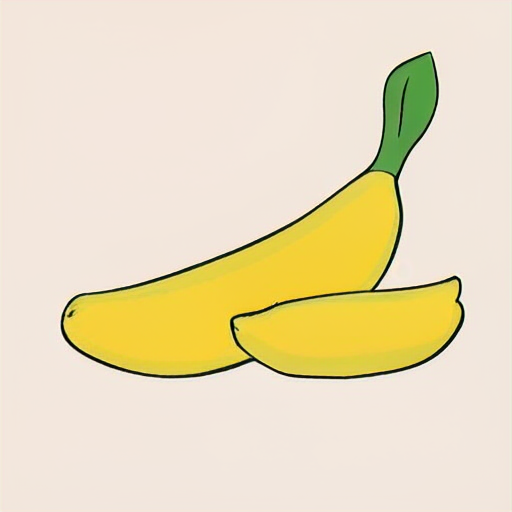
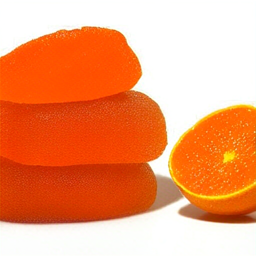
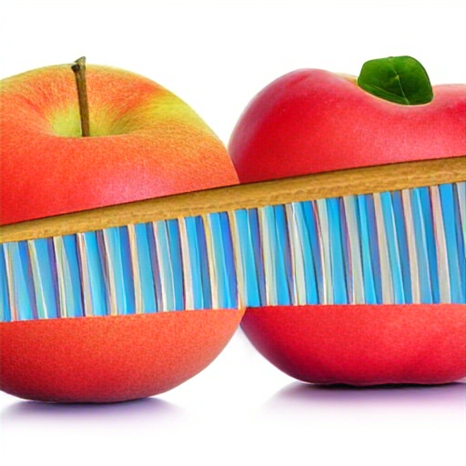
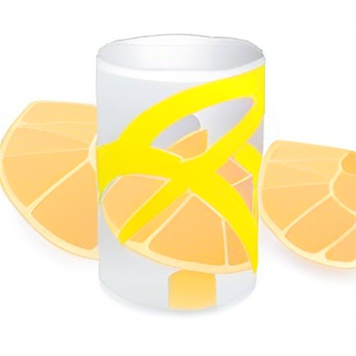

# Multimodal Structured Generation

Generate interleaved text and image content in a structured format you can directly pass to downstream APIs. You can also use this to control how many "draft" text tokens and "imagination" image tokens the model generates first before it starts generating the final output.

Example output:

```json
{
    "fruit_name": "Banana",
    "fruit_image": "<image>",
    "images_of_related_fruits": [
        "<image>",
        "<image>",
        "<image>",
    ]
}
```

With the images saved to disk.

NOTE: This is a work in progress. It currently only supports vector-quantized vision-language models (e.g. Chameleon & its finetunes), but it should work on soft vector vision-language models too with little modification (hopefully).

Preprint coming up.

## Installation

```bash
pip install -e .
```

To install everything:

```bash
pip install -e .[test]
```

## Examples

Scripts to run the examples are in the `scripts` directory.

### Text-only generation

#### Text to text generation

```bash
python scripts/text_only_generation.py --prompt "Are bananas fruits or vegetables?"
```

Prompt: `"Are bananas fruits or vegetables?"`

Response: `Bananas are technically a fruit. They are the seeds of the plantain, a type of flowering plant, and the flesh is formed from the ovary. However, bananas are often classified as a vegetable for culinary purposes, especially in many Asian countries.`

#### Text-image to text generation

```bash
python scripts/text_only_generation.py --inference_mode text-image-to-text --prompt "Which constellation is this?" --image_1_path "https://nineplanets.org/wp-content/uploads/2020/12/the-big-dipper-1.jpg"
```


Prompt: `"Which constellation is this?"`

Response: `That's the constellation Ursa Major.`

#### Multi-image to text generation

```bash
python scripts/text_only_generation.py --inference_mode multi-image-to-text --prompt "What do these two images have in common?" --image_1_path "https://nineplanets.org/wp-content/uploads/2020/12/the-big-dipper-1.jpg" --image_2_path "https://www.kxan.com/wp-content/uploads/sites/40/2020/10/ORION.jpg"
```

 

Prompt: `"What do these two images have in common?"`

Response: `Both are constellations.`

### Image-only Generation

#### Text to image generation

```bash
python scripts/image_only_generation.py --inference_mode text-to-image --prompt "Draw a banana"
```

Prompt: `"Draw a banana"`

Response:


#### Text-image to image generation

```bash
python scripts/image_only_generation.py --inference-mode text-image-to-image --max-new-tokens 2500 --prompt "text-image-to-image" --prompt "Draw a variation of this image" --image-1-path "https://huggingface.co/microsoft/kosmos-2-patch14-224/resolve/main/snowman.jpg"
```


Prompt: `"Draw a variation of this image"`

Response:


I honestly don't know why it decided to draw an alien. But it's cool!

#### Multi-image to image generation

TODO

### Interleaved Text and Image Generation

TODO

### Structured Generation

```bash
python scripts/structured_generation.py --prompt "Please generate a fruit along with a picture of it and related fruits."
```

Prompt: "Please generate a fruit along with a picture of it and related fruits."

Json schema:

```json
{
    "name": "Fruit Generator",
    "description": "A tool that generates details about a fruit with text and images in one go!",
    "type": "object",
    "properties": {
        "fruit_name": {
            "type": "string",
            # "minLength": 1,
            # "maxLength": 20,
            "pattern": "[a-zA-Z0-9]{1,20}",
        },
        "fruit_image" : {
            "type": "image",
            # "maxLength": 10,
        },
        "images_of_related_fruits" : {
            "type": "array",
            "items": {
                "type": "image",
                # "minLength": 1,
            },
            "minItems": 3,
            "maxItems": 3,
        }
    },
    "required": ["fruit_name", "fruit_image", "images_of_related_fruits"],
}
```

Response: `{"fruit_name": "Banana", "fruit_image": "<image>", "images_of_related_fruits": ["<image>", "<image>", "<image>"]}`

Image 1:


Image 2:


Image 3:


Image 4:


### Structured Imagination

TODO

### For the GPU Poors like me

We can run the scripts on Modal's GPUs by replacing `python scripts/structured_generation.py` above with `modal run scripts/modal_inference.py::run_inference`. That's it!

#### Installing Modal

If you haven't installed Modal yet, you can do so by running:

```bash
pip install modal
```

Then setup your modal.com account and:

```bash
modal setup
```

Then run the scripts!

## Cite

```bibtex
@misc{cesista2024mmsg,
  author = {Franz Cesista},
  title = {Multimodal Structured Generation},
  year = {2024},
  publisher = {GitHub},
  journal = {GitHub repository},
  howpublished = {\url{https://github.com/leloykun/mmsg}},
}
```

## Acknowledgements

The models used in this work are based on [Meta's Chameleon](https://huggingface.co/facebook/chameleon-7b) and [GAIR's Anole](https://huggingface.co/GAIR/Anole-7b-v0.1) models. This was also made a _lot_ easier by [Outlines](https://github.com/outlines-dev/outlines). Please cite their work too!

Also big thanks to @zucchini-nlp and @ArthurZucker for feedback while integrating the models into Transformers!
